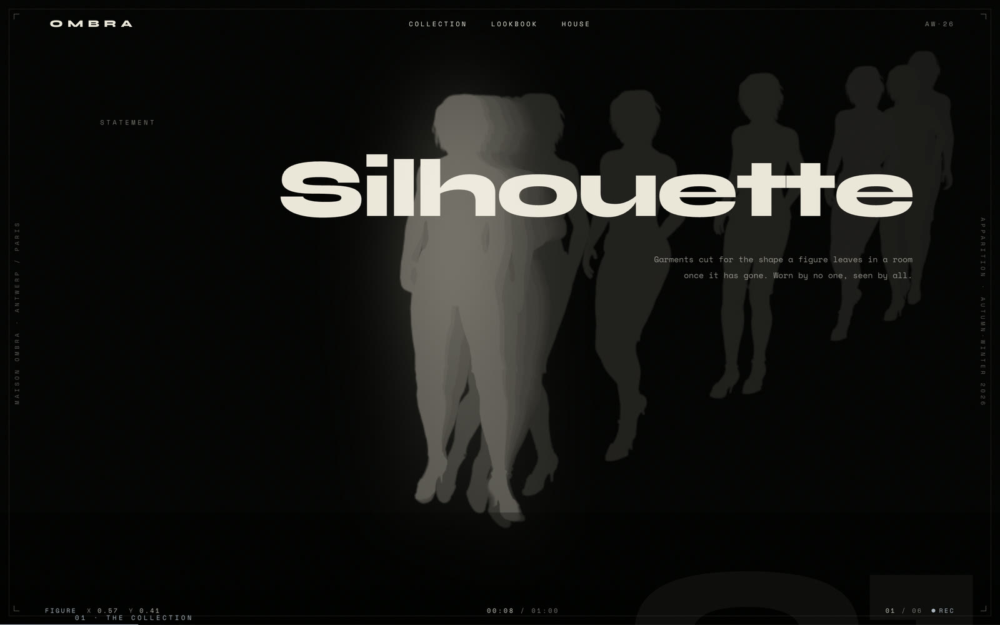
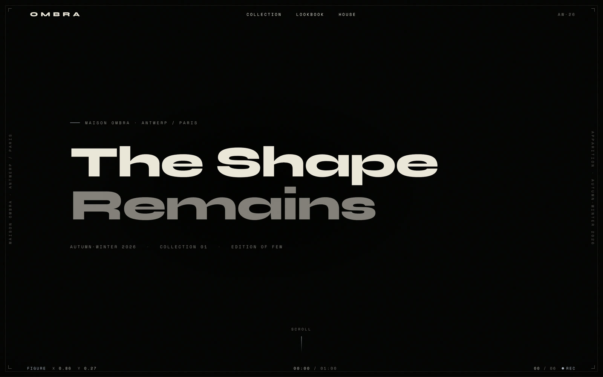
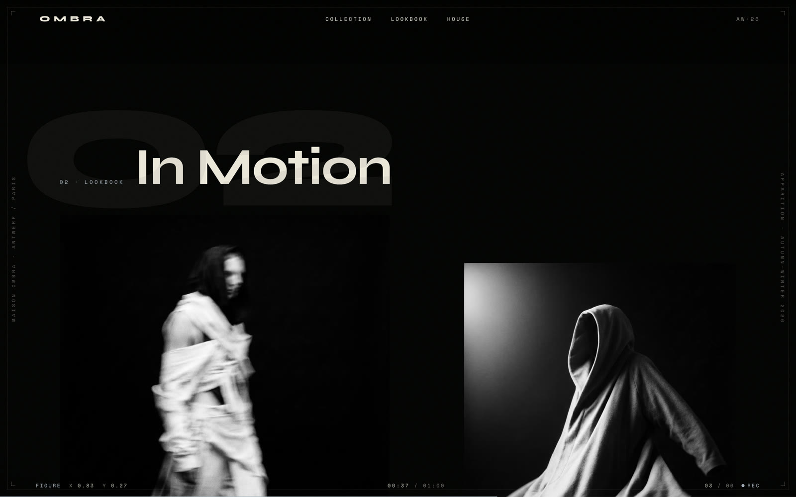
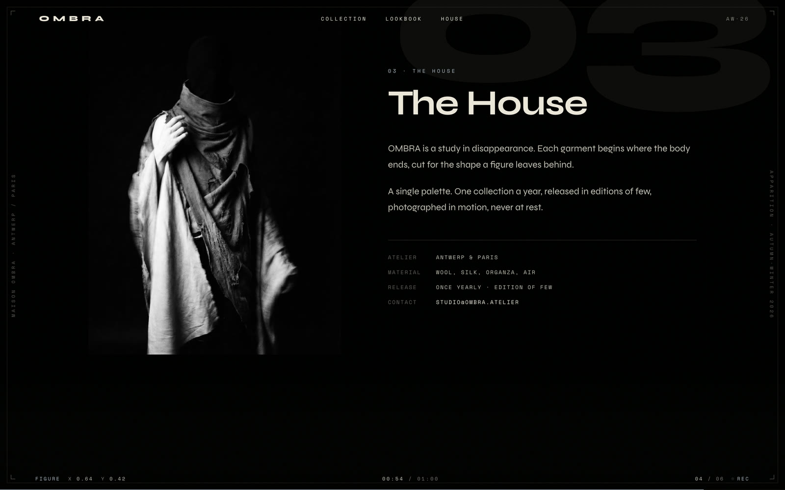
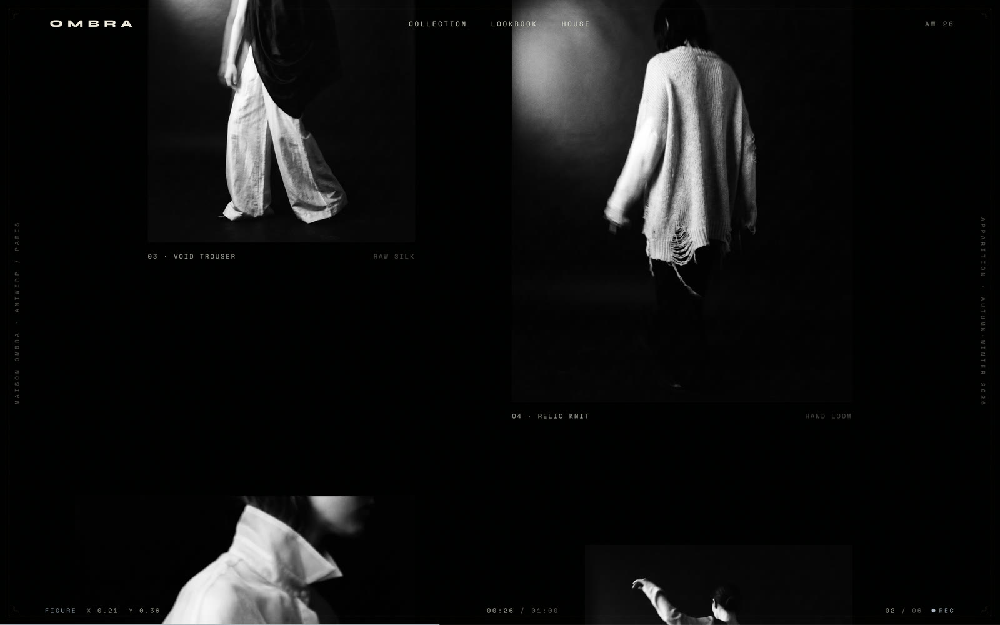
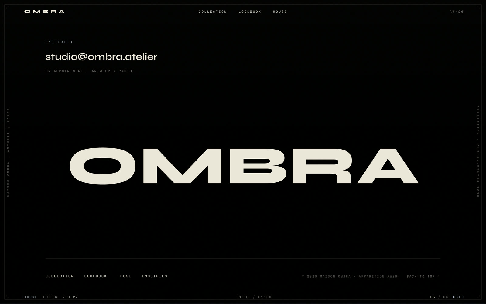
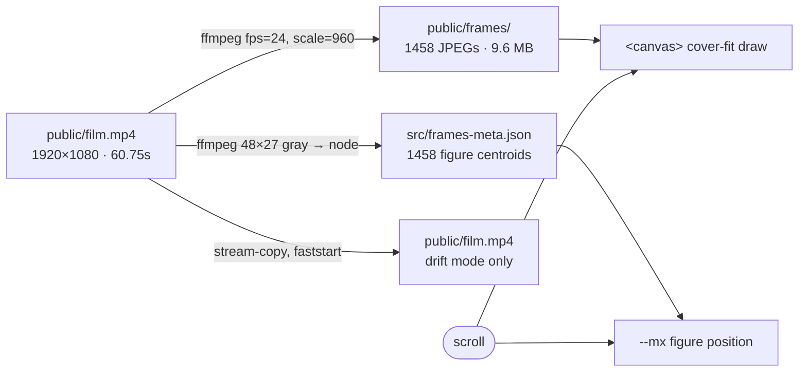
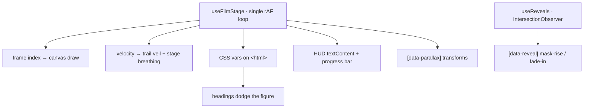

<div align="center">

# OMBRA

**Scroll-scrubbing a 1,458-frame sequence on a canvas, and letting the page's
typography track the figure walking behind it.** A fashion-house landing page
for a house that does not exist, built as an excuse to solve the interesting
part: how do you drive a film from scroll without the stutter, and how does the
layout know where the subject is?

[**→ Live site**](https://koray.dev/ombra/)

[](https://github.com/raelsei/ombra/actions/workflows/deploy.yml?query=branch%3Amain)
[](LICENSE)




<sub>The apparition trail — scroll velocity smears the figure into ghosts of itself.</sub>

</div>

---

Two things here are worth reading the source for:

1. **A pre-decoded frame sequence instead of a seekable video.** Assigning
   `currentTime` restarts decode from the nearest keyframe, so a scrubbed video
   stutters no matter how you ease it. Drawing JPEGs to a `<canvas>` is exactly
   scroll-locked — at the cost of 1,458 files and a density budget you have to
   get right. [Why, and the arithmetic.](#why-a-frame-sequence-not-a-video)
2. **Build-time perceptual metadata.** One ffmpeg pass emits a 48×27 grayscale
   stream; ~30 lines of dependency-free node reduce it to the luminance centroid
   of the bright figure in every frame. At runtime that is a two-float array
   lookup, so headings can dodge a moving subject with no per-frame pixel work.
   [The pipeline.](#why-a-frame-sequence-not-a-video)

Maison OMBRA itself is **fictional**, the imagery is AI-generated and the film is
Pixabay stock — set dressing, disclosed in [Credits](#credits). The code is
~1,880 lines of TypeScript, a 220-line stylesheet and a single
`requestAnimationFrame` loop, with React as the only runtime dependency. It is a
concept piece, not a product: see [Limitations](#limitations) before you judge it
as one.

## The signature

<table>
<tr>
<td width="50%"></td>
<td width="50%"></td>
</tr>
<tr>
<td><b>Figure tracking.</b> The hero heading slides away from the walking figure and the statement heading leans toward it, both driven by one CSS variable fed from the build-time centroid table.</td>
<td><b>Editorial grid.</b> A 12-column asymmetric layout with per-item parallax, staggered baselines and a slow zoom on hover.</td>
</tr>
<tr>
<td></td>
<td></td>
</tr>
<tr>
<td><b>Typographic inversion.</b> Display headings carry <code>mix-blend-mode: difference</code> — where the bright figure walks behind them, the letters flip dark.</td>
<td><b>Instrumented chrome.</b> A registration frame, side rails and a live HUD reading the figure's centroid, film timecode and section index.</td>
</tr>
</table>

<details>
<summary>More screens</summary>




</details>

## Quick start

```bash
npm install
npm run dev        # http://localhost:5173
npm run build      # tsc -b && vite build → dist/
npm run preview    # serve the production build
npm run lint       # eslint
```

Node 20+ (CI builds on 22). No API keys, no env file, no backend. `node --test
scripts/` runs the unit tests for the centroid reducer.

## Why a frame sequence, not a video

Scroll-scrubbing a compressed video by assigning `currentTime` is choppy by
construction: every seek restarts decode from the nearest keyframe. So the
default **frame-scrub** mode ignores the video entirely and draws a
**pre-decoded JPEG sequence** into a `<canvas>` — exactly scroll-locked, at a
bandwidth cost measured in [What it costs](#what-it-costs-on-the-wire).



**Frame density is the whole trick.** The page scrolls ≈8,500px at a 1600×1000
viewport; at 1458 frames that is ≈6px of scroll per frame, so the film steps
imperceptibly and reads as continuous motion. A sparse sequence (say 150 frames
→ ~57px/frame) visibly stutters. Both sides of that ratio are yours: `FPS` in
`scripts/build-assets.sh` sets the numerator, your page height the denominator
— aim for **frames ≈ scrollable px / 6**. Frames average **6.7 KB** and are
decoded on demand rather than up front, so density costs bandwidth, not RAM.

Regenerate every derived asset with one script (`ffmpeg` + `node` on `PATH`):

```bash
npm run assets                 # re-derive from the shipped public/film.mp4
npm run assets my-clip.mov     # swap in your own footage
```

| Output | How | Used by |
|---|---|---|
| `public/frames/001…1458.jpg` | `fps=24, scale=960:-1` | frame-scrub canvas |
| `src/frames-meta.json` | 48×27 gray raw → node centroid pass | figure position lookup |
| `public/film.mp4` | `-c copy -movflags +faststart` | drift mode (`moov` atom first) |
| `public/film-poster.jpg` | single frame @1.5s | `<video poster>` |

The luminance pass uses the **same `fps`** as the frame export, so centroid *N*
lines up with frame *N* exactly.

> [!IMPORTANT]
> **The pipeline has one hard input requirement: a bright subject on a
> near-black field.** `TH=62` in `scripts/build-assets.sh` is a luminance cut.
> Feed it a daylight clip and most pixels clear the threshold, every centroid
> collapses toward 0.5, and the figure tracking is inert — the scrub still
> works, so the failure is invisible. `scripts/centroids.mjs` counts frames it
> could not locate a subject in and warns loudly when more than a quarter of
> them are degenerate; if you see that warning, tune `TH` and re-run.

## How it runs

`src/hooks/useFilmStage.ts` owns **one** `requestAnimationFrame` loop. Per frame
it writes a handful of CSS custom properties on `<html>` plus a few
`textContent` updates — no per-node scroll listeners, no React re-renders for
animation, no layout thrash.



| CSS var | Meaning | Consumed by |
|---|---|---|
| `--mx` | figure centroid X, eased | hero + apparition heading "dodge" |
| `--p` | scroll progress 0–1 | scroll cue fade |
| `--film-fade` | film visibility | stage opacity (0 at load → 1 → 0 at Collection) |
| `--film-x` | entrance offset | figure slides in from beyond the right edge |
| `--film-scale` | stage "breathing" | 1.04 → 1.06 with scroll velocity |
| `--live` · `--grain` | accent colour · grain toggle | set once from the URL config |

- **Frame-scrub (default).** Scroll progress → target frame; the float index
  eases toward it (`0.2` lerp); the nearest frame is cover-fit drawn, and only
  when the rounded index changes.
- **Apparition trail.** While scrolling, the canvas is dimmed each frame by a
  velocity-dependent black veil and the current frame is stamped with
  `lighten`, so only the bright figure accumulates — the faster you scroll, the
  longer the trail. Tuning lives in `useFilmStage.ts` (`velNorm` divisor 48,
  veil `0.26 − 0.2·heat`).
- **Smooth drift** (`?motion=drift`). The `<video>` plays natively and scroll
  velocity ramps `playbackRate` (up to ~3.4×, `0.06` lerp) instead of seeking.
  The centroid is sampled live from a 48×27 offscreen canvas rather than the
  build-time lookup.
- **Light seep.** A half-resolution, heavily blurred, `screen`-blended copy
  of the film sits *above* the content: where the figure passes behind a panel
  or a photograph, its light bleeds through like a lamp behind fabric.
- **Reveals.** `IntersectionObserver` (`src/hooks/useReveals.ts`) — mask-rise
  for display headings, fade + rise + blur for everything else, first viewport
  immediate, with a 6s safety net so nothing can stay hidden.
- **Reduced motion.** `prefers-reduced-motion: reduce` freezes the film on a
  still frame, drops the rAF loop entirely, skips reveal animation and kills
  every CSS transition.

### URL config

Appending a query parameter overrides a default — handy for review and for
grabbing stills.

| Query | Effect |
|---|---|
| `?motion=drift` | smooth-drift renderer instead of frame-scrub |
| `?accent=#C9A227` | accent from `{A9B4C0, C9A227, B4472E, 8E97A6, E3DCCB}` |
| `?grain=0` | disable film grain |
| `?fig=0` | hide the `FIGURE X/Y` instrument readout |
| `?speed=0.7` | drift idle playback speed (0.2–1.5) |

## Structure

```
src/
  App.tsx                  URL config → CSS vars, mounts chrome + six sections
  data.ts                  all copy and grid placement — single source of truth
  index.css                design tokens, breakpoints, reduced-motion kill switch
  frames-meta.json         build-time figure centroid per frame
  hooks/
    useFilmStage.ts        the engine: one rAF loop, both renderers, the trail
    useReveals.ts          IntersectionObserver reveal pass
    usePrefersReducedMotion.ts
  components/
    FilmStage.tsx          canvas / video / light-seep / grain layers
    Chrome.tsx             registration frame, corner ticks, side rails
    Nav.tsx  StatusBar.tsx  Loader.tsx  GhostIndex.tsx  ImageSlot.tsx
    sections/              Hero · Apparition · Collection · Lookbook · House · Footer
scripts/build-assets.sh    the whole media pipeline
scripts/centroids.mjs      the centroid reducer (+ .test.mjs, node --test)
docs/imagery.md            the eleven image slots and the visual rule
```

Layering is deliberate: film backdrop at `z1`, grain + vignette at `z2`, content
at `z3`, light seep at `z4`, loader at `z200`. The figure lives *behind* the
collection — the stage recedes, the garments lead.

## Imagery

Eleven slots, resolved by filename: drop `public/images/<slot-id>.jpg` in place
and it wires itself up; miss one and a refined empty well shows instead. Slot
ids, aspect ratios and the shared visual rule are documented in
[`docs/imagery.md`](docs/imagery.md).

## What it costs on the wire

Measured on the deployed site (`https://koray.dev/ombra/`, headless Chrome,
1440×900, unthrottled broadband), because a page that streams a film sequence
should publish its bill rather than call itself "lightweight":

| | |
|---|---|
| First contentful paint | **1.4 s** |
| First film frame drawn, loader cleared | **2.5 s** after `DOMContentLoaded` |
| JS bundle | **249 kB** raw / **77 kB** gzip (React + 23 kB centroid table) |
| Requests / bytes by the time the film is live | 893 / **5.96 MB** |
| Requests / bytes once the sequence has fully streamed | **1,469 / 9.70 MB** |
| Repo media | 16 MB (9.6 MB of frames, 2.8 MB film, 0.9 MB stills) |

That is the honest shape of the trade: the page is *interactive* fast and
*complete* slowly. `preloadAll()` currently fires all 1,458 frame requests on
mount with no concurrency cap and no connection check, which is fine on this
laptop and wrong on a phone on cellular — see [Limitations](#limitations).
Reduced-motion visitors are spared entirely: that branch loads exactly one
frame and never schedules a rAF.

## Reuse it

The site is not a starter kit — the copy and layout are couture-specific. But
two mechanisms transfer cleanly, and the pipeline genuinely accepts any clip.

**Take the technique:**

- `scripts/centroids.mjs` — ffmpeg raw grayscale stream → dependency-free
  reducer → JSON sidecar. Generalises to any per-frame perceptual property you
  want cheap at runtime: average luminance for adaptive text colour, motion
  energy, dominant edge position.
- The trail in `useFilmStage.ts` — a velocity-scaled black veil plus a
  `globalCompositeOperation = 'lighten'` stamp. ~12 lines, no framebuffer
  ping-pong, no motion-blur library.

**Put your own film behind your own copy:**

1. `npm run assets my-clip.mov` — derives frames, poster, faststart mp4 and the
   centroid table. Frame count is read from `frames-meta.json`, never hardcoded,
   so a shorter clip just works.
2. Check the footage requirement above (bright subject, near-black field), and
   heed the degenerate-frame warning if it fires.
3. Target **frames ≈ your scrollable px / 6** via `FPS` in the script.
4. Replace the copy in `src/data.ts` — hero, statement, collection, looks,
   house, nav and footer all live there.
5. Rewrite the `<title>`, description and `og:*` tags in `index.html`.
6. **Keep the engine's DOM contract.** `useFilmStage.ts` reaches into the DOM by
   literal id and attribute; rename these and features die silently:

   | Hook | Needed by |
   |---|---|
   | `id="collection"` | the film's fade-out anchor — rename it and the film never fades |
   | `#fig-x` `#fig-y` `#scrub` `#dur` `#idx-cur` `#idx-tot` `#pbar` | the HUD readouts the loop writes |
   | `[data-screen-label]` | section index in the HUD |
   | `[data-parallax]` | per-element parallax speed |
   | `[data-reveal]` | `useReveals` targets |

   The scrub core is roughly the first half of `useFilmStage.ts`; `writeChrome`,
   `writeFilmFade` and `parallaxPass` are site glue you can delete.

## Limitations

Known, deliberate, and not yet fixed — listed so you do not have to find them:

- **Eager frame loading.** All 1,458 requests go out on mount. A windowed
  loader (coarse spine + sliding window biased by scroll direction, bounded
  in-flight) is the right design and is the next thing to build.
- **No server-rendered content.** `index.html` ships an empty `#root`, so with
  JS disabled the page is blank and there is no `<noscript>` fallback. For a
  marketing-genre page that is the wrong default.
- **No mobile navigation.** Below 620px `#topnav` is hidden with no replacement
  affordance; sections are reachable only by scrolling or via the footer nav.
- **Blend-mode contrast is unmeasurable by construction.** Display headings use
  `mix-blend-mode: difference` over a moving film, so their contrast ratio is a
  function of the frame behind them. Deliberate, but it cannot pass an automated
  audit.
- **Tests cover the reducer only.** `node --test scripts/` exercises the
  centroid maths and its degenerate-input boundaries. The rAF loop and canvas
  compositing are verified by hand, not in CI.
- **9.6 MB of frames live in git.** Committed so a clone is a working site with
  no ffmpeg step, but `npm run assets` rewrites every blob, so each regeneration
  adds another ~9.6 MB to history permanently. Generating in CI or attaching a
  release artifact would be the grown-up answer.

## Deploying to GitHub Pages

[`.github/workflows/deploy.yml`](.github/workflows/deploy.yml) lints,
type-checks and builds on every push and pull request, then publishes `dist/`
to Pages on `main` — **no manual step per release, every push to `main` ships.**

One-time setup per repository — point Pages at Actions, either in
**Settings → Pages → Build and deployment → Source: GitHub Actions**, or once
from the CLI:

```bash
gh api -X POST /repos/<owner>/<repo>/pages -f build_type=workflow
```

Project sites are served from `/<repo>/`, so the workflow passes
`BASE_PATH=/${{ github.event.repository.name }}/` and `vite.config.ts` reads it.
Every runtime asset URL is composed from `import.meta.env.BASE_URL`, so the
frame sequence, film and images resolve under any sub-path — and stay at the
root for local dev, `vite preview` and custom domains.

## Credits

- **Film** — `public/film.mp4` is stock footage from
  [Pixabay](https://pixabay.com/) (Pixabay Content License: free to use, no
  attribution required), kept in the repo because the whole frame pipeline
  derives from it. Swap in your own clip with `npm run assets <file>`.
- **Imagery** — the eleven photographs are AI-generated (Google Nano Banana Pro),
  graded to one black-and-white world. See [`docs/imagery.md`](docs/imagery.md).
- **Type** — [Syne](https://fonts.google.com/specimen/Syne) for display,
  [Space Mono](https://fonts.google.com/specimen/Space+Mono) for the instruments.
- **Influences** — Maison Margiela, Rick Owens, Comme des Garçons,
  Ann Demeulemeester.

## License

[MIT](LICENSE) — the code only. The media in `public/` is not mine to
relicense: see [Credits](#credits) before reusing the film or the imagery.
