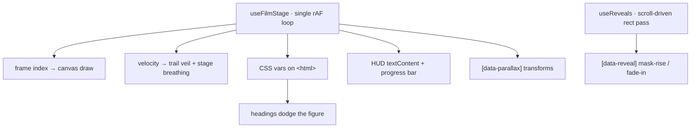

# Engine

How the page animates: the single `requestAnimationFrame` loop in
`src/hooks/useFilmStage.ts`, the values it writes, the two renderers, and the DOM
contract all of it depends on. The [README](../README.md) is the overview.

## The loop

One rAF loop owns every per-frame update, writing five CSS custom properties on
`<html>` plus a few `textContent` values — no per-node scroll listeners, no React
re-renders for animation. React state changes once, when the loader clears.



| CSS var | Meaning | Consumed by |
|---|---|---|
| `--mx` | figure centroid X, 0–1, eased | Hero heading slides away (`2.4vw`), Apparition heading leans in (`3vw`) |
| `--p` | scroll progress 0–1 | Hero scroll-cue fade, `calc(1 - var(--p)*7)` |
| `--film-fade` | film visibility | canvas/video opacity; light seep at half strength |
| `--film-x` | entrance offset | film + seep `translateX`, up to `11vw` before fade-in completes |
| `--film-scale` | stage "breathing" | film `scale`, 1.04 → 1.06 with scroll velocity |

`--film-scale` is written only when it moves by more than `0.0005`; the rest go
out every frame. `--film-fade` is the smaller of a fade-in over the first `0.6`
viewport heights of scroll and a fade-out keyed to the live
`getBoundingClientRect().top` of `#collection`, so it survives resize.

## Renderers and passes

- **Frame scrub (default).** Scroll progress maps to a target frame index; a
  float index eases toward it, and the nearest frame is drawn cover-fit into the
  `<canvas>` at up to 2× DPR. With the trail cold, the canvas is redrawn only
  when the rounded index changes. The centroid for that index is a two-float read
  from `frames-meta.json` — no per-frame pixel work.
- **Apparition trail.** While scrolling, the canvas is dimmed each frame by a
  velocity-dependent black veil, then the current frame is stamped with
  `globalCompositeOperation = 'lighten'`, so only the bright figure accumulates:
  faster scroll, thinner veil, longer trail. At rest the ghosts dissolve in under
  a second, and the index cache is invalidated so the settled state gets one
  clean stamp. The light-seep canvas takes a plain stamp, never the trail.

| Pass | Behaviour |
|---|---|
| Smooth drift (`?motion=drift`) | the `<video>` plays natively and scroll velocity ramps `playbackRate` instead of seeking; the centroid is sampled live from a 48×27 offscreen canvas at the same luminance threshold (`62`) the build-time pass uses, so drift needs no sidecar data |
| Light seep | a half-resolution, heavily blurred (`28px`–`56px`), `screen`-blended copy of the film sits *above* the content, so where the figure passes behind a panel or a photograph its light bleeds through like a lamp behind fabric |
| Reveals (`useReveals.ts`) | a passive `scroll`/`resize` listener runs at most one `getBoundingClientRect` pass per frame over the elements still pending, showing each once its top crosses `0.96` of a viewport height and dropping it from the list; the listeners detach when the list empties, and the first pass waits for the loader to fade. Deliberately not an `IntersectionObserver`: the mask-rise headings sit at `translateY(115%)` inside an `overflow: hidden` wrapper, so an observer on the target measures a ratio of zero and never fires. Transitions are inline per element — mask-rise for display headings, fade + rise + blur elsewhere |
| Parallax | `[data-parallax]` media translates against the viewport centre at its own speed, the applied offset subtracted before measuring so the fixed point stays the layout position |
| Reduced motion | `prefers-reduced-motion: reduce` takes a separate branch: one still frame, no rAF at all, chrome updated from a passive `scroll` listener, centroid pinned to frame 0's. The `index.css` kill switch zeroes every transition, so reveals apply instantly instead of animating |

## Constants

| Quantity | Value |
|---|---|
| scroll velocity | `vel = vel*0.86 + abs(dY)*0.14`, a per-frame EMA |
| frame index easing | lerp `0.2` toward `progress * (count - 1)` |
| centroid easing | lerp `0.11`, both axes |
| trail heat | `max(min(1, vel/48), heat*0.94)`, trail active above `0.02` |
| veil alpha | `0.26 - 0.2 * heat` |
| stage scale | `1.04 + 0.02 * heat` |
| drift rate | `idle + min(3.4, vel*0.06)`, lerp `0.06`, clamped `0.1`–`6`; the `3.4` caps the boost, not the rate |
| loader failsafe | `2600 ms` — reveals the page if the first draw stalls |

## URL config

Read once on mount. `accent` and `grain` are written one time as `--live` and
`--grain`; `fig` and `speed` live in refs, so the loop never tears down.

| Query | Effect |
|---|---|
| `?motion=drift` | smooth-drift renderer instead of frame-scrub |
| `?accent=#C9A227` | accent from `{A9B4C0, C9A227, B4472E, 8E97A6, E3DCCB}`; anything else falls back |
| `?grain=0` | disable film grain |
| `?fig=0` | hide the `FIGURE X/Y` instrument readout |
| `?speed=0.7` | drift idle playback rate, clamped 0.2–1.5, default 0.5 |

## Structure

```
src/
  App.tsx                  URL config → CSS vars, mounts chrome + six sections
  data.ts                  all copy and grid placement — single source of truth
  index.css                design tokens, breakpoints, reduced-motion kill switch
  frames-meta.json         build-time figure centroid per frame
  hooks/
    useFilmStage.ts        the engine: one rAF loop, both renderers, the trail
    useReveals.ts          scroll-driven reveal pass
    usePrefersReducedMotion.ts
  components/
    FilmStage.tsx          canvas / video / light-seep / grain layers
    Chrome.tsx             registration frame, corner ticks, side rails
    Nav.tsx  StatusBar.tsx  Loader.tsx  GhostIndex.tsx  ImageSlot.tsx
    sections/              Hero · Apparition · Collection · Lookbook · House · Footer
scripts/build-assets.sh    the whole media pipeline
scripts/centroids.mjs      the centroid reducer (+ .test.mjs, npm test)
```

Layering is deliberate: ghost numerals at `z0`, film backdrop at `z1`, grain +
vignette at `z2`, content at `z3`, light seep at `z4`, chrome at `z80`, nav and
status bar at `z100`, loader at `z200`. The figure lives *behind* the collection
— the stage recedes, the garments lead.

## The DOM contract

The hook reaches into the DOM by literal id and attribute. Rename these and
features die silently — nothing throws.

| Hook | Needed by |
|---|---|
| `id="collection"` | the film's fade-out anchor; rename it and the film never fades out |
| `#fig-x` `#fig-y` `#scrub` `#idx-cur` `#pbar` | HUD readouts written every frame |
| `#dur` `#idx-tot` | written once on mount, from the frame count and the section count |
| `[data-screen-label]` | the section list, in document order, for the HUD index |
| `[data-parallax]` | per-element parallax speed, parsed as a float |
| `[data-reveal]` | `useReveals` targets |

The scrub core is the frame-index and trail block inside `loop`, plus
`drawImageCover`; `writeChrome`, `writeFilmFade` and `parallaxPass` are site glue.

## Reuse

Two mechanisms transfer cleanly. `scripts/centroids.mjs` — an ffmpeg raw
grayscale stream reduced by dependency-free node into a JSON sidecar —
generalises to any per-frame perceptual property you want cheap at runtime:
adaptive text colour, motion energy, dominant edge position. And the trail is a
veil plus a `lighten` stamp: a dozen lines, no motion-blur library.

To put your own film behind your own copy:

1. `npm run assets my-clip.mov` — derives frames, poster, faststart mp4 and the
   centroid table. Frame count and fps come from `frames-meta.json`, so a
   shorter clip just works.
2. Check the footage requirement (bright subject, near-black field) and heed the
   degenerate-frame warning if it fires.
3. Target **frames ≈ your scrollable px / 6** via `FPS` in the script.
4. Replace the copy in `src/data.ts` — hero, statement, collection, looks, house,
   nav and footer all live there.
5. Rewrite the `<title>`, description and `og:*` tags in `index.html`.
6. Keep the DOM contract above.
