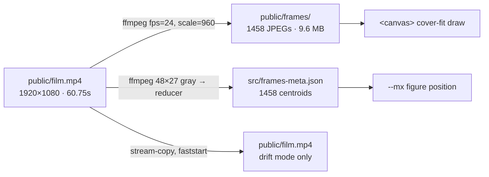

# Film

How the frame sequence is produced, why it exists instead of a video, and how
it is loaded. The [README](../README.md) is the overview;
[`engine.md`](engine.md) covers the runtime loop that draws it.

## Frames, not a seekable video

Scroll-scrubbing a compressed video by assigning `currentTime` is choppy by
construction: every seek restarts decode from the nearest keyframe. A
pre-decoded JPEG sequence drawn to a `<canvas>` is exactly scroll-locked
instead.

**Frame density is the whole trick.** The page scrolls ≈8,000px; at 1,458
frames that is ≈5px of scroll per frame, so the film steps imperceptibly. A
sparse sequence (150 frames → ~53px/frame) visibly stutters. Both sides of the
ratio are yours — `FPS` in `scripts/build-assets.sh`, and your page height. Aim
for **frames ≈ scrollable px / 6**.

## The pipeline

One script regenerates every derived asset (`ffmpeg` + `node` on `PATH`):

```bash
npm run assets                 # re-derive from the shipped public/film.mp4
npm run assets my-clip.mov     # swap in your own footage
```



| Output | How | Used by |
|---|---|---|
| `public/frames/001…1458.jpg` | `fps=24, scale=960:-1`, ~6.7 KB each | the scrub canvas |
| `src/frames-meta.json` | 48×27 gray → `scripts/centroids.mjs` | figure position |
| `public/film.mp4` | `-c copy -movflags +faststart` | drift mode (`?motion=drift`) |
| `public/film-poster.jpg` | frame at 1.5s | `<video poster>` |

The luminance pass uses the **same `fps`** as the frame export, so centroid *N*
is frame *N* by construction.

`scripts/centroids.mjs` is a dependency-free reducer over the raw grayscale
stream: for every pixel above the threshold it accumulates weight `l − TH`, then
normalises the weighted centroid to 0–1. `npm test` covers it — blob position,
the threshold boundary, excess-over-threshold weighting, stream order, partial
frames and degenerate geometry.

> [!IMPORTANT]
> **The pipeline needs a bright subject on a near-black field.** `TH=62` in
> `scripts/build-assets.sh` is a luminance cut. Feed it a daylight clip and
> every centroid collapses toward 0.5 and the figure tracking goes inert while
> the scrub keeps working — an invisible failure. The reducer counts frames it
> could not locate a subject in and warns when more than a quarter are
> degenerate.

## Loading

1,458 frames is 9.6 MB. Requesting them all on mount saturates the connection
and starves the actual content, so frames are fetched against the playhead:

- a coarse **spine** every 24th frame, so any scroll position has something
  drawable,
- a **window** around the current frame, biased in the scroll direction,
- at most **6 open requests**, with the queue recomputed every frame from the
  live playhead so scrolling away never leaves stale work queued.

When the exact frame has not landed, the nearest loaded one is drawn. Nothing is
force-decoded; `drawImage` decodes against the browser's own cache, so density
costs bandwidth, not RAM. Reduced-motion visitors load exactly one frame and
never schedule a rAF.

### Measured

Same harness, same scroll, eager vs. windowed — mobile viewport on throttled 4G
(1.6 Mbps, 150 ms RTT):

| | eager | windowed |
|---|---|---|
| First film frame | 0.55 s | **0.55 s** |
| Two editorial photographs on screen | 27.8 s | **0.75 s** |
| Data spent by that point | 6.97 MB | **0.27 MB** |

Unthrottled, the first film frame lands after 12 requests / 0.13 MB instead of
1,462 / 9.65 MB, and the eleven photographs finish in 4.5 s instead of 10.7 s.
Total bytes for a full scroll-through are unchanged — the sequence still
streams, just behind the content instead of in front of it.

No rendering regression: at five scroll positions the HUD centroid and timecode
readouts are byte-identical between the two builds, and the screenshots differ
only by animation phase (PSNR 37–51 dB).

## Known limitations

- **No server-rendered content.** `index.html` ships an empty `#root` with no
  `<noscript>` fallback.
- **No mobile navigation.** Below 620px the top nav is hidden with no
  replacement; sections are reachable by scrolling or via the footer.
- **Blend-mode contrast is unmeasurable by construction.** Display headings use
  `mix-blend-mode: difference` over a moving film, so their contrast ratio is a
  function of the frame behind them.
- **Tests cover the reducer only.** The rAF loop and canvas compositing are
  verified by hand.
- **9.6 MB of frames live in git.** Committed so a clone is a working site, but
  `npm run assets` rewrites every blob, so each regeneration adds ~9.6 MB to
  history permanently.
